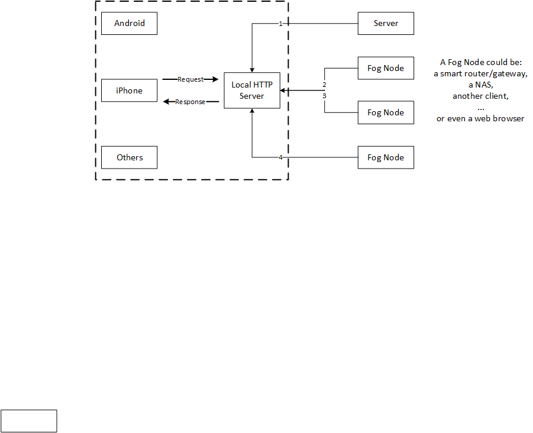
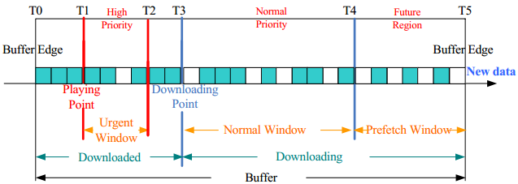
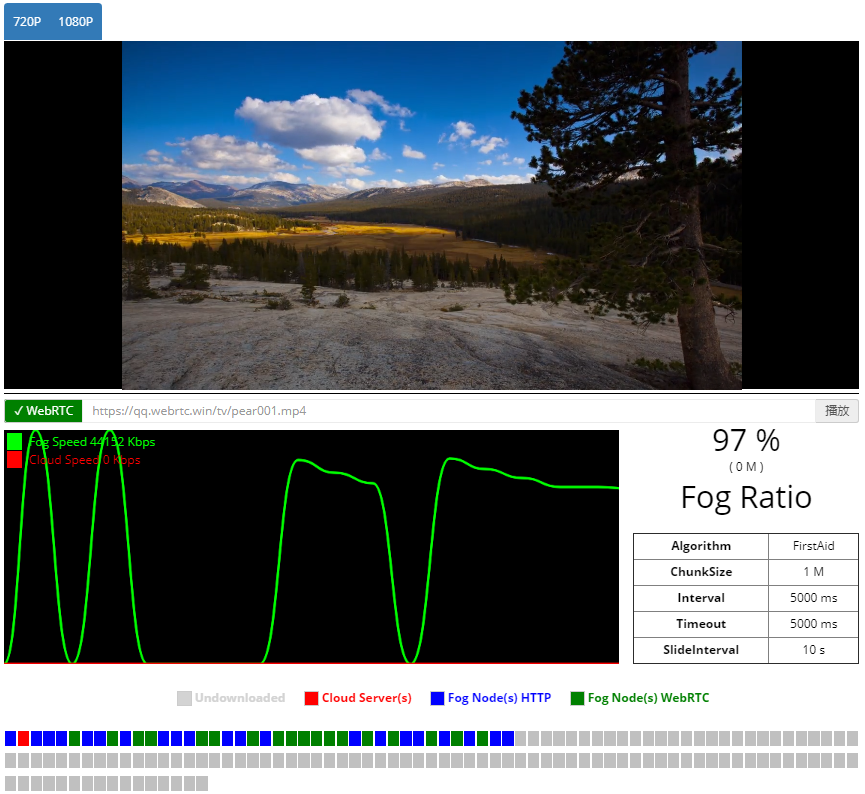

* minihttpd-libcurl 之前基于这个测试修改
* libevent-libcurl  确定新的架构及基础类库，@zitao后续代码提交到此目录下


## 基于HTTP/HTTPS多源P2P流媒体播放器


### 整体架构

客户端整体架构及流程如下：通过一个本地的HTTP Server(127.0.0.1),播放器端所有的数据请求都经过本地服务(至少要Hook HEAD GET请求，GET请求要支持Range参数)，客制化的HTTP Server去后台请求数据数据喂给播放器，最大程度的解耦各个模块。




### REST API

1. 登录返回Token,请求节点的时候需要此Token做为安全验证。通过调用我们提供的API接口（/v1/customer/login）并传入用户名和密码， 我们已经为访客提供了测试帐号（用户名：test　密码：123456），获取token的示例代码如下:

```
r=`curl  -X POST https://api.webrtc.win:6601/v1/customer/login \
  -H "Content-Type:application/json" \
  -d '{
    "user": "test",
    "password":  "123456"
   }'`
```

2. 请求节点列表，后台服务器会返回N个有效节点

请求节点：

```
r=`curl -X GET "https://api.webrtc.win:6601/v1/customer/nodes?client_ip=127.0.0.1&host=qq.webrtc.win&uri=${file}&md5=ab340d4befcf324a0a1466c166c10d1d" \
  -H "X-Pear-Token: ${token}" \
  -H "Content-Type:application/json"`
```

返回节点：

```
{
  "nodes": [
    {
      "protocol": "https",
      "host": "000c29d049f4.webrtc.win:65526",
      "type": "node"
    },
    {
      "protocol": "https",
      "host": "2076933cdd51.webrtc.win:34038",
      "type": "node"
    },
    {
      "protocol": "https",
      "host": "5254005d31ff.webrtc.win:4582",
      "type": "server"
    }
  ]
}
```

### 下载策略(First-Aid算法，@xt补充)

1. 获取节点列表，视频文件大小，算出文件固定码率(动态计算需要下载的部分文件)
2. 节点按照节点质量排序，抛弃不能连通的节点
3. 优质节点下载紧急部分，其它部分依次排序
4. 触发下一个下载周期
   * 剩余播发时间超过阈值
   * 用户拖动播放条
   * 定时器
5. 所有节点的失效的情况，直接回源请求该视频文件或者重新请求节点列表(此情况极端情况下发生)


具体原理图参考：


参考Brower端达到的效果（Chrome测试结果）：

