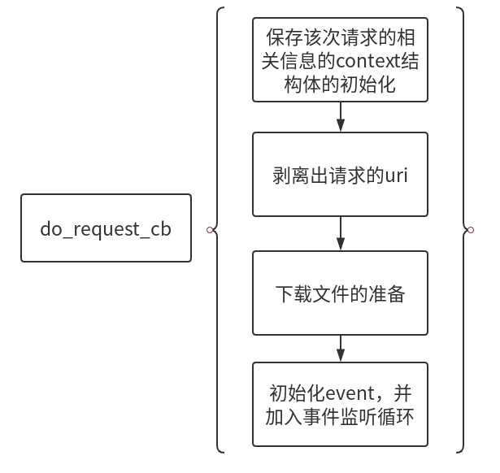
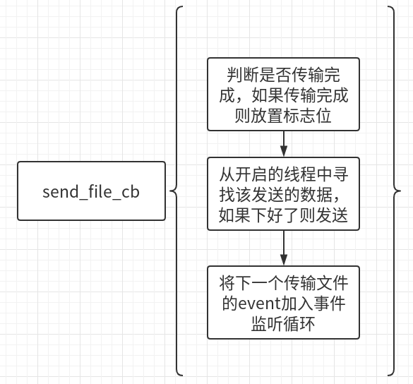
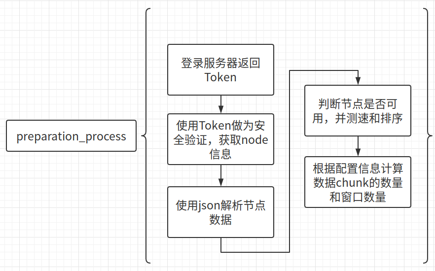

# 整体结构
根据Client-SDK/README.md可知，整体架构为

对于local http server，这里的实现方式为使用libevent库和libcurl协作完成，其中Libevent为一个事件驱动的底层网络库，主要作用是实现http server的对端口的监听，libcurl是一个网络传输协议库，其主要功能是传输数据。整个程序的主要逻辑为：

libevent内部有一个事件监听循环，这里记为event loop，该循环会不断监听绑定的端口发送来的请求，如果收到请求，则调用请求相对的回调函数do_request_cb，这个回调函数主要功能如下：

do_request_cb最后一步为初始化发送数据的event，该event触发时会调用回调函数send_file_cb，该函数主要功能为：

综上，整体的运行流程是： 
1. 事件监听循环event_loop监听到请求，调用回调函数do_request_cb 
2. 回调函数do_request_cb执行，获取到节点并分别对节点测速，将信息保存在send_file_ctx结构体中，并将发送数据的event加入到事件监听循环中，触发事件的条件是隔1s触发 
3. 1s后，事件监听循环触发发送数据的event，调用事件相关的回调函数send_file_cb，此函数根据send_file_ctx中的信息判断现在发送到哪个数据chunk，并从线程池中找正在下载该chunk的线程，如果该chunk至少有一个thread下载完了，则发送该chunk，并将这个event再次加入事件监听循环 
4. 事件监听循环event_loop触发event，调用事件相关的回调函数send_file_cb，根据send_file_ctx中的信息发现已经发送完所有的chunk，则释放资源，结束请求 

# 节点获取及文件下载
## 节点获取
为了实现多源下载的目标，首先要从服务器获取token，然后使用token获得多个节点，获得多个节点后还需要对节点测速排序等，之后才能开始真正的下载，这一步在do_request_cb的【下载文件的准备】这一步中完成，这一步的接口函数为preparation_process，其流程为：

上图中的功能对应的函数分别为：
1. 登录服务器返回token: login 
2. 获取node信息: get_node 
3. 解析节点数据: node_info_init 
4. 判断节点是否可用，测速和排序: get_node_alive 

## 文件下载
根据send_file_cb的流程图，每次滑动窗口时调用函数window_download，此函数都会开启新的线程，开启的线程数量根据预先配置的chunk大小和window大小决定，若chunk为1MB，window为10MB，则每次开启10个线程。下载的具体策略请见Client-SDK/README.md。 
直接下载文件的函数为get_file_range，此函数使用libcurl，支持http byte-range请求。

# 编译方式及运行
## 编译方式
make clean 
make
## 使用方式
./server ~/test
第一个参数设置为服务器的根目录文件夹，端口号为60000，之后任意访问服务器下的某个文件，就能输出结果。

