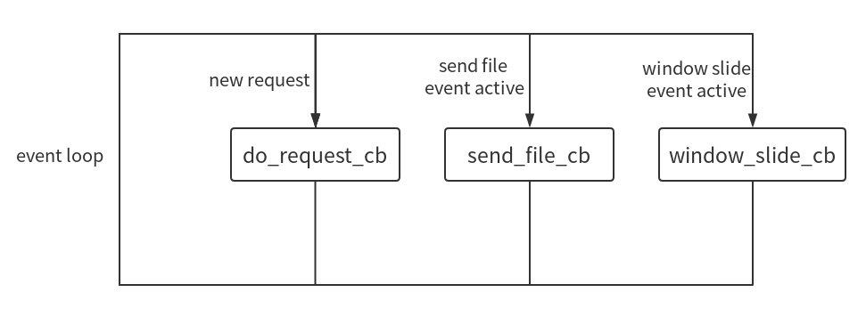

# 整体结构
根据Client-SDK/README.md可知，整体架构为

对于local http server，这里的实现方式为使用libevent库和libcurl协作完成，其中Libevent为一个事件驱动的底层网络库，其主要逻辑为：

# 编译方式及运行
## 编译方式
make clean 
make
## 使用方式
./server ~/test
第一个参数设置为服务器的根目录文件夹，端口号为60000，之后任意访问服务器下的某个文件，就能输出结果。

